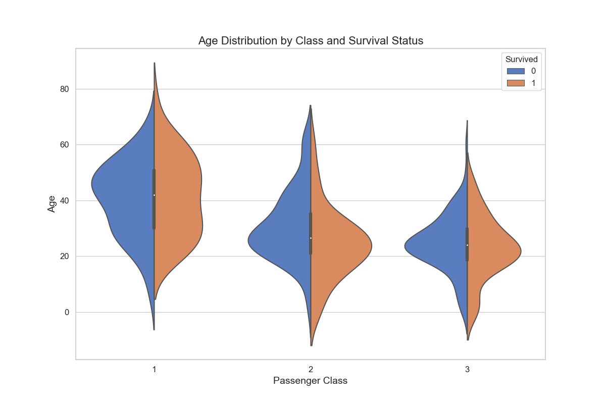
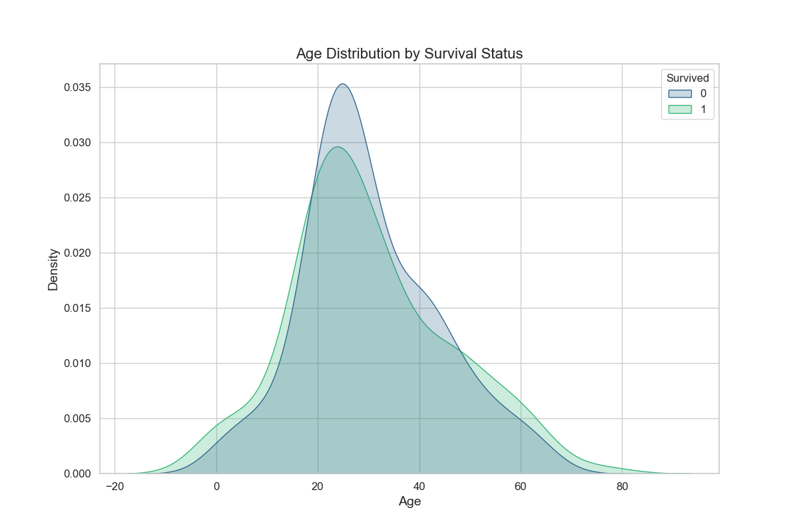
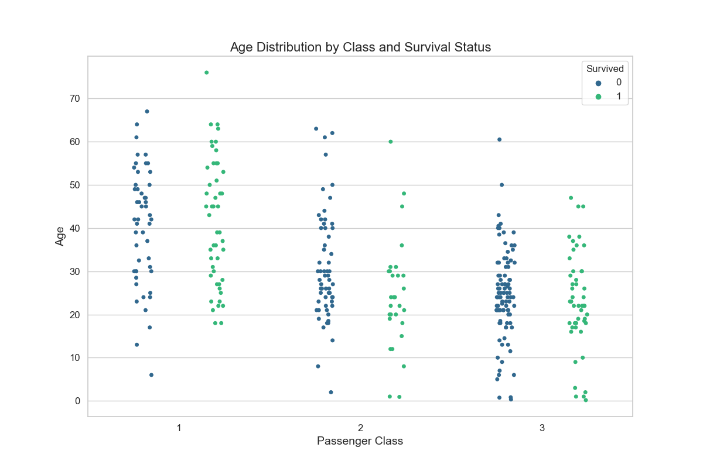
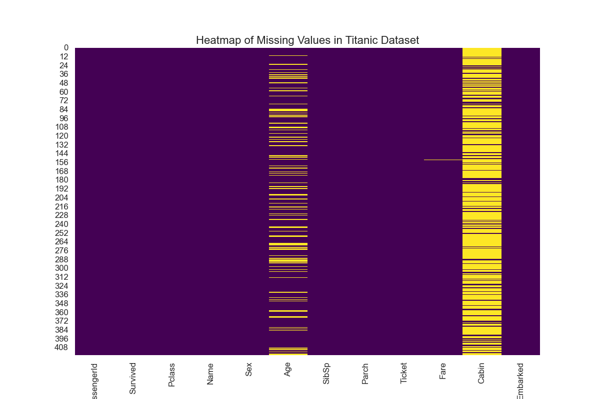

# Visualization Scripts

This repository contains a collection of Python scripts to create various visualizations using the Titanic dataset as example. These scripts are designed to be generic and reusable for other datasets with minimal modifications.

Link to Titanic dataset: https://www.kaggle.com/datasets/brendan45774/test-file

## Table of Contents
- [Installation](#installation)
- [Usage](#usage)
- [Visualizations](#visualizations)
- [Example Plots](#example-plots)

## Installation

1. Clone the repository:
    ```sh
    git clone https://github.com/your-username/titanic-visualizations.git
    cd titanic-visualizations
    ```

2. Install the required dependencies:
    ```sh
    pip install -r requirements.txt
    ```

## Usage

1. Ensure you have the Titanic dataset CSV file named `tested.csv` in the root directory of the repository.

2. Run the script to generate the desired plots. Example:
    ```sh
    python generate_plots.py
    ```

## Visualizations

The following visualizations can be generated using the provided scripts:

1. **Bar Chart**: Survival rate by gender
2. **Histogram**: Age distribution of passengers
3. **Scatter Plot**: Age vs. Fare
4. **Pairwise Relationships**: Pairwise relationships of selected columns
5. **Violin Plot**: Fare distribution by class and survival status
6. **Stacked Bar Chart**: Number of passengers by class and embarkation port
7. **3D Scatter Plot**: Age, Fare, and Pclass
8. **Sunburst Chart**: Hierarchical distribution of classes and survival
9. **Density Plot**: Age distribution by survival status
10. **Correlation Heatmap**: Correlation heatmap of numerical features
11. **Boxplot**: Age distribution by survival status
12. **Pie Chart**: Survival status proportion
13. **Count Plot**: Number of passengers by class
14. **Strip Plot**: Age distribution by class and survival status
15. **Heatmap of Missing Values**: Pattern of missing values in the dataset

## Example Plots

Here are some example plots generated using the provided scripts:

1. **Bar Chart**: 
2. **Histogram**: 
3. **Scatter Plot**: 
4. **Pairwise Relationships**: 
5. **Violin Plot (Fare)**: 
6. **Violin Plot (Age)**: 
7. **Stacked Bar Chart**: 
8. **3D Scatter Plot**: 
9. **Sunburst Chart**: 
10. **Density Plot**: 
11. **Correlation Heatmap**: 
12. **Boxplot**: 
13. **Pie Chart**: 
14. **Count Plot (Class)**: 
15. **Count Plot (Embarked)**: 
16. **Strip Plot**: 
17. **Heatmap of Missing Values**: 

To generate these images, run the example usage code provided in the script.


